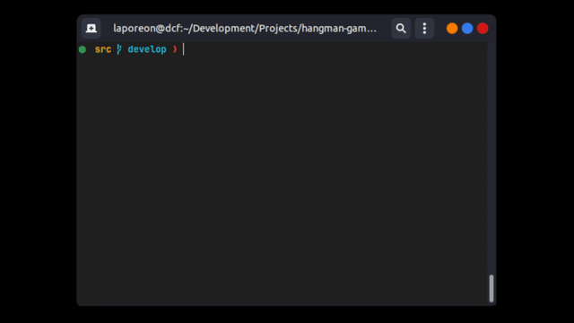

<h1 align="center"> 🧩 Hangman Game</h1>

## Table of Contents

- [About](#about)
- [Requirements](#requirements)
- [Usage](#usage)
- [Preview](#preview)

## About
This is a Java-based implementation of the classic Hangman game. The game selects a random tech-related word, and the player has a limited number of attempts to guess the word one letter at a time. Test your technology vocabulary knowledge in a fun command-line experience.

**Some features:**

- Detects repeated guesses.
- Input validation for non single-letter or any other invalid entries.
- Console-based UI with colorized output.

**Project Structure:**

```
├── application
│   └── HangmanGame.java     # Game logic and main loop
├── helpers
│   ├── Validators.java      # Input validation helpers
│   └── Words.java           # Word bank and word rendering
├── enums
│   └── Colors.java          # ANSI color codes for console output
└── Main.java                # Game entry point
```

## Requirements:

- [Java](https://www.java.com/en/) v.17 or higher

## Usage

Compile and run via terminal by running the following command inside the `src` folder.

```bash
javac Main.java && java Main
```

Then follow on-screen instructions.

## Preview




[⬆ Back to the top](#--hangman-game)